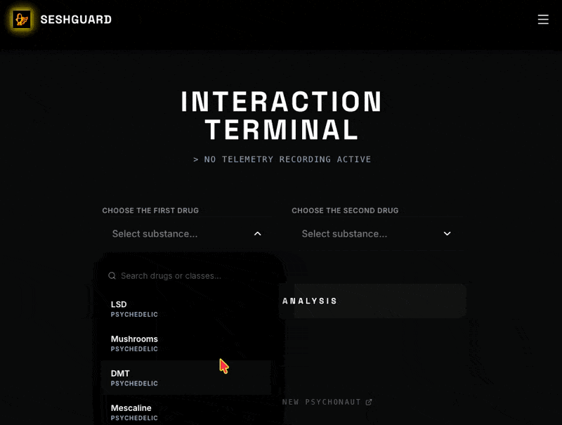

<div align="center">

# 🛡️ SeshGuard

**AI-Assisted Educational Harm-Reduction Tool**

*Granular interaction guide for identifying pharmacological risks and interactions*

**Live demo:** [www.seshguard.newpsychonaut.com](https://www.seshguard.newpsychonaut.com/) · [seshguard.azurewebsites.net](https://seshguard.azurewebsites.net)

[](LICENSE)



</div>

---

## What it is

SeshGuard is an interactive safety and harm-reduction guide designed to help users quickly identify potential risks and interactions between various substances. Powered by the Gemini API, it provides rapid interaction readouts and summaries based on established pharmacological data, allowing users to make more informed decisions.

With a dark-mode glassmorphism aesthetic and clear visual risk indicators, SeshGuard keeps critical safety information accessible and easy to digest.
## Why it matters

- 🔍 **Interaction Risk Matrix** — instantly compare substances for contraindicated pairings
- 🤖 **AI-Generated Insights** — clear, synthesized explanations of potential pharmacological interactions
- 💾 **Local Favorites Storage** — save key interaction pairs in browser local storage
- 🎨 **Clear Visual Hierarchy** — color-coded risk levels (Warning, Danger, Unknown) for rapid assessment
- 📱 **Mobile-Responsive Design** — accessible on the go when quick information is needed

## Tech Stack

| Layer | Technology |
|-------|-----------|
| Frontend | React + TypeScript + Vite |
| AI | Google Gemini API |
| Design | Tailwind CSS, Lucide Icons, Framer Motion |
| Deployment | Azure App Service (Linux) |

## Quickstart

```bash
# Clone the repository
git clone https://github.com/chaosste/SeshGuard.git
cd SeshGuard

# Install dependencies
npm install

# Configure your Gemini API key in .env.local
echo "GEMINI_API_KEY=your_api_key_here" > .env.local

# Run development server
npm run dev

# Build for production
npm run build

# Assemble the Azure deployment bundle
npm run package:azure

# Type-check
npm run lint
```

## Azure Deployment

This repo is wired to deploy to the existing Azure App Service below:

| Setting | Value |
|-------|-----------|
| App Service | `seshguard` |
| Resource group | `neurophenom_group-a499` |
| Region | `switzerlandnorth` |
| Runtime | Linux Node `22-lts` |

Deployment is handled by GitHub Actions in [.github/workflows/deploy-azure.yml](/Users/stephenbeale/Projects/SeshGuard/.github/workflows/deploy-azure.yml). The workflow builds and tests the app, then assembles a deployment folder containing:

- `dist/`
- `server.js`
- `package.json`
- `package-lock.json`
- production-only `node_modules`

This avoids the source-only zip problem that caused Azure to miss runtime packages such as `dotenv`.
The workflow then uploads the resulting zip through Kudu Zip Deploy, which is the App Service path that treats the artifact as prebuilt instead of trying to rebuild it with Oryx on the server.

### One-time setup

1. Prefer GitHub OIDC for deploy auth by adding `AZURE_CLIENT_ID`, `AZURE_TENANT_ID`, and `AZURE_SUBSCRIPTION_ID` as repository or environment secrets.
2. Or add the fallback secret `AZURE_WEBAPP_PUBLISH_PROFILE` with the App Service publish profile XML.
3. Ensure the App Service has the `GEMINI_API_KEY` application setting configured.
4. Keep the Azure startup command set to `node server.js`, or unset it if the App Service runtime already starts the same entrypoint.
5. Keep `SCM_DO_BUILD_DURING_DEPLOYMENT=false` and `ENABLE_ORYX_BUILD=false` for this app, because the deployed zip is already fully built.
6. Optionally set the App Service health check path to `/api/health`.
4. Keep the Azure startup command unset unless you intentionally want to override the default Node startup behavior.
5. Optionally set the App Service health check path to `/api/health`.

### Linux publish profile note

Microsoft documents that Linux web apps may require the app setting `WEBSITE_WEBDEPLOY_USE_SCM=true` before you download a publish profile from the Azure Portal. If the portal blocks publish profile download, set that app setting first and retry.

If GitHub Actions fails with `Conflict (CODE: 409)` or the runtime later logs `Cannot find package 'dotenv'`, App Service is usually trying to rebuild the prebuilt artifact with Oryx. That rebuild path is not compatible with the packaged `dist/ + server.js + production node_modules` layout used here.
If GitHub Actions fails with `No credentials found. Add an Azure login action before this action`, the publish profile secret is usually stale, malformed, or from before a Linux SCM-enabled download. Re-download it and replace the secret, or switch the workflow to the OIDC secrets above.

### Deploy

- Push to `main` to trigger the production deployment workflow.
- Or run the workflow manually from the GitHub Actions tab with `workflow_dispatch`.

## Related Projects

> 💡 **Looking for ceremonial guidance?** See **[EntheoGen Mixed Modality Guide](https://github.com/chaosste/EntheoGen)** — a deterministic, evidence-grounded fork of SeshGuard designed specifically for clinical and ceremonial contexts.

## Disclaimer

SeshGuard provides educational harm-reduction guidance only. It **does not** provide medical, psychological, or therapeutic advice. Interaction ratings are sourced from a curated dataset and can include unknown gaps. If you suspect toxicity, serotonin syndrome, or a hypertensive crisis, seek immediate medical help.

---

<div align="center">

**Built by [Steve Beale](https://newpsychonaut.com)**

[newpsychonaut.com](https://newpsychonaut.com)

© 2026 Stephen Beale. MIT License.

</div>
